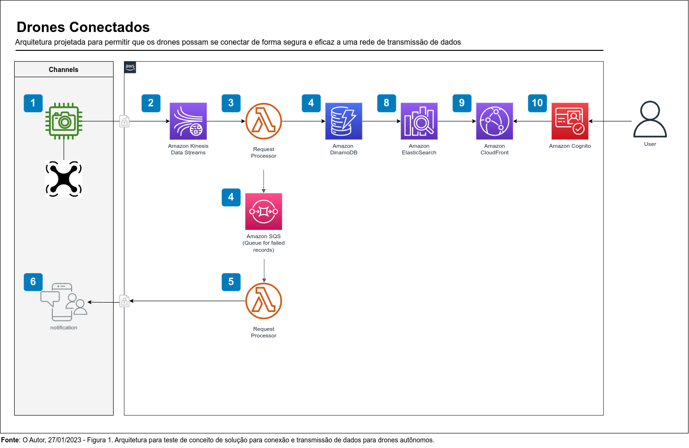
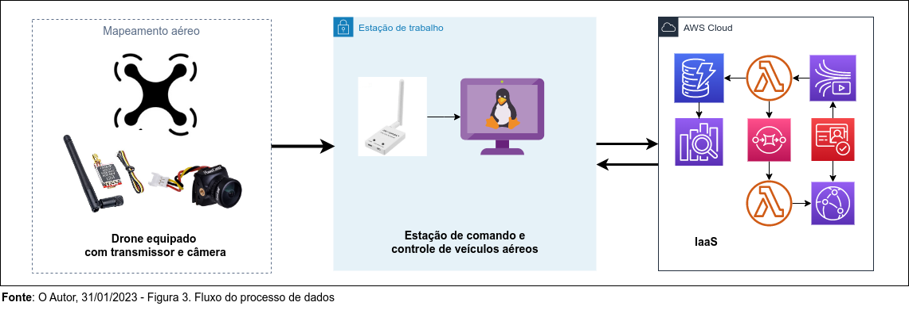

# Publish-Subscribe (Pub/Sub)


“A inovação é a única maneira de vencer a concorrência e prosperar”. - Jeff Bezos


**Introdução**


O Publish-Subscribe (também conhecido como pub/sub) é uma arquitetura de mensagens orientada a eventos que permite que os serviços se comuniquem de forma assíncrona. Esta abordagem é ideal para aplicações em tempo real que precisam lidar com grandes volumes de dados. O objetivo deste artigo é descrever uma prova de conceito usando Python, Publish-Subscribe, Kinesis, ESP32, API Gateway, Lambda, Elasticsearch, Kibana e DynamoDB para construir uma plataforma de análise de dados em tempo real.


**Descrição da Prova de Conceito**


Implamentar uma Plataforma que permita, coletar dados de dispositivos IoT, processar os dados usando API e armazená-los no DynamoDB. Os dados devem ser publicados no Kinesis, para que possam ser consumidos via Elasticsearch e Kibana para análise.


**Arquitetura da Solução**


>Existem várias soluções para este problema, neste documento vamos estudar e avaliar a viabilidade da prova de conceito (POC001).


**Objetivo**

Elaborar e implementar uma arquitetura, que permita drones possam se conectar de forma segura e eficaz a uma rede de transmissão de dados. Esta arquitetura é composta de vários componentes, que permitem aos drones se comuniquem com: a Estação Terrestre Gerenciamento, entre si e com outras redes, transmitindo e recebendo dados.





 Envio de fluxo de dados (stream de audio e vídeo), através de dispositivos na estrutura (frame) do VANT.


**[ATENÇÃO]**

Ao ligar o receptor Skydroid 5.8OTG esteja a uma distância segura do transmissor 5G8 TS 5828L, os principais riscos são:

1. Interferência de outros sinais de rádio e Wi-Fi próximos. Isso pode resultar em uma recepção de sinal instável e, eventualmente, perda de dados.

2. Radiação eletromagnética. O uso de um receptor 5.8GHz próximo a um transmissor 5G8 pode resultar em uma exposição indesejável a campos eletromagnéticos.

3. Sobrecarga de temperatura. O uso de um receptor 5.8GHz próximo a um transmissor 5G8 pode resultar em um aumento na temperatura do receptor, o que pode levar a danos permanentes.





Coleta de Dados


Processamento de Dados


```python

```

**Referências:**


[ 1 ] [https://micropython.org/download/esp32-ota/](https://micropython.org/download/esp32-ota/)<br>
[ 2 ] [https://micropython.org/resources/firmware/esp32-ota-20220618-v1.19.1.bin](https://micropython.org/resources/firmware/esp32-ota-20220618-v1.19.1.bin)<br>
[ 3 ] [https://docs.micropython.org/en/latest/esp32/quickref.html](https://docs.micropython.org/en/latest/esp32/quickref.html)<br>

```python

```
